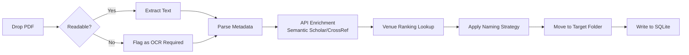
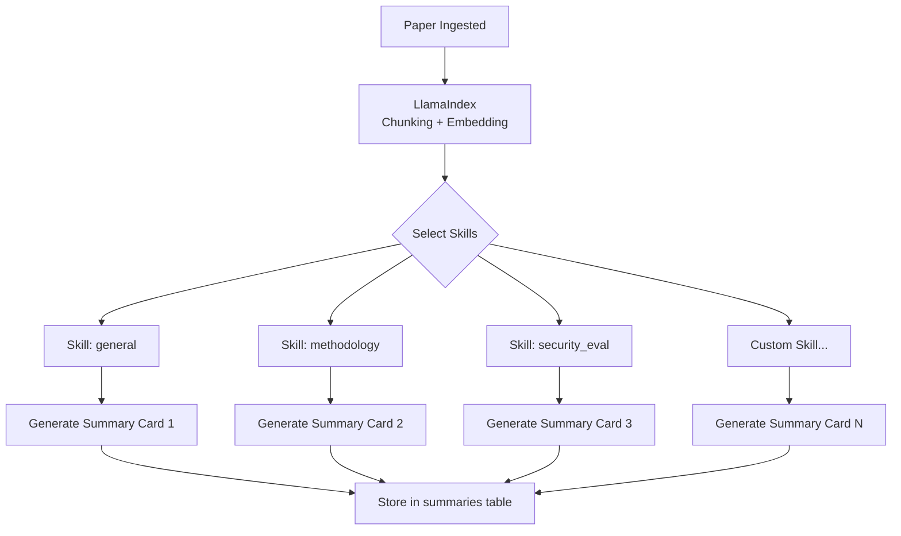
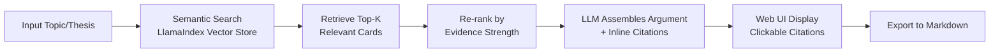

# Cardex

[](./VERSION)
[](./LICENSE)

English | [繁體中文](./README.zh-TW.md)

> **Academic Knowledge Management System** — Complete lifecycle from PDF to structured knowledge cards

Cardex is a fully programmatic academic literature management system designed for researchers. It has no dependency on any GUI application; all data is stored in open formats (SQLite + Markdown) and can be visualized through self-hosted web services.

> ⚠️ **Pre-release**: This project is in active development (0.X versioning). Breaking changes may occur before 1.0.0 release.


---

## 📋 Table of Contents

- [Core Features](#core-features)
- [System Architecture](#system-architecture)
- [Workflow](#workflow)
- [Quick Start](#quick-start)
- [Tech Stack](#tech-stack)
- [Development Roadmap](#development-roadmap)

---

## ✨ Core Features

### 🎯 Design Philosophy

- **Fully Programmatic** - No GUI dependency, fully operable via CLI or API
- **Open Formats** - SQLite (single source of truth) + Markdown (knowledge cards)
- **Self-hosted** - Not a SaaS, your data stays on your machine
- **AI-powered** - LlamaIndex + pluggable LLM backend

### 💡 Unique Capabilities

1. **Skill System** - Generate multiple summary cards from different analytical angles
   - Examples: methodology perspective, security evaluation, evidence strength analysis
   - Fully extensible: just add YAML + Markdown files

2. **Evidence Grading** - Automatic evidence strength assessment based on journal/conference rankings
   - Tier 1 (Strong): Nature/Science/CORE A* + RCT methodology
   - Tier 2-4: Progressive decline
   - Locally overridable ranking data

3. **Argue Engine** - AI-assisted argument generation
   - Extract relevant evidence from your library
   - Weight and rank by evidence strength
   - Generate structured arguments with inline citations

4. **Citation Tracking** - Automatic citation graph construction
   - Flag "cited but not yet ingested" papers
   - Track research groups and academic lineage

---

## 🏗️ System Architecture

Cardex uses a layered pipeline design. Each layer can be operated independently via CLI and accessed collectively through the Web UI:

```
┌─────────────────────────────────────────────────────────────┐
│                         Web UI (Layer 7)                     │
│              FastAPI Backend + React Frontend                │
└─────────────────────────────────────────────────────────────┘
                              ▲
                              │
┌─────────────────────────────────────────────────────────────┐
│  Layer 6: Argue         │  Topic input → AI composes argument│
├─────────────────────────────────────────────────────────────┤
│  Layer 5: Quality       │  Evidence strength evaluation      │
├─────────────────────────────────────────────────────────────┤
│  Layer 4: Graph         │  Build citation graph, detect gaps │
├─────────────────────────────────────────────────────────────┤
│  Layer 3: Summarize     │  Apply Skill definitions           │
├─────────────────────────────────────────────────────────────┤
│  Layer 2: Metadata      │  Extract bibliographic data + enrich│
├─────────────────────────────────────────────────────────────┤
│  Layer 1: Ingest        │  File intake, integrity check      │
└─────────────────────────────────────────────────────────────┘
                              ▲
                              │
                         ┌────┴────┐
                         │  PDFs   │
                         └─────────┘
```

---

## 🔄 Workflow

### Stage 1: Literature Ingestion (Ingest Pipeline)



**Details:**
- File integrity check (openable, extractable structure)
- Text extraction below threshold → flag as "OCR required" (v1 does NOT perform OCR)
- Extract title, authors, year from PDF
- Enrich via Semantic Scholar / CrossRef API for DOI, venue, etc.
- Query CORE / JCR database for journal ranking
- Rename and move to correct folder based on YAML naming strategy

### Stage 2: Knowledge Card Generation (Skill System)



**Details:**
- One paper can have multiple Skills applied
- Each Skill generates an independent summary card
- All cards stored in Markdown format in `summaries` table
- Skill definitions in `skills/` folder as YAML + Markdown prompt

**Skill Example**:
```yaml
# skills/methodology.yaml
name: methodology
description: Focus on research design, datasets, evaluation metrics
output_format: markdown
prompt_template: methodology_prompt.md
```

### Stage 3: Citation Graph (Citation Graph)

```mermaid
graph TD
    A[Parse Reference List] --> B[Extract cited papers'<br/>DOI/Title]
    B --> C{In library?}
    C -->|Yes| D[Create citing_id → cited_id relation]
    C -->|No| E[Record to citations table<br/>in_library=0]
    D --> F[Update citation count]
    E --> G{Cited ≥ N times?}
    G -->|Yes| H[Generate "Unread Alert"]
    G -->|No| I[Keep record]
```

**Details:**
- Extract reference list from paper (LLM parsing or dedicated parser)
- Cross-check against library, flag ingested vs. not-yet-ingested
- "Cited multiple times but not yet ingested" papers trigger alerts in Web UI

### Stage 4: AI-Assisted Argumentation (Argue Engine)



**Details:**
- User inputs topic or thesis statement
- Semantic search finds most relevant knowledge cards
- Tier 1 papers weighted higher
- Every LLM-generated claim maps to specific paper + page number
- Output includes evidence tier badges

---

## 🚀 Quick Start

### Requirements

- Python 3.10+
- Docker + Docker Compose (for quick deployment)
- (Optional) Ollama (for local LLM inference)

### Installation

```bash
# Clone the repository
git clone https://github.com/your-username/cardex.git
cd cardex

# Create virtual environment
python -m venv venv
source venv/bin/activate  # Windows: venv\Scripts\activate

# Install dependencies
pip install -r requirements.txt

# Configure environment variables
cp .env.example .env
# Edit .env to add API keys (if using OpenAI/Anthropic)
```

### Quick Test

```bash
# Initialize database
python -m cardex.cli init

# Ingest first paper
python -m cardex.cli ingest path/to/paper.pdf

# Start Web UI
python -m cardex.web
# Open browser at http://localhost:8000
```

### Docker Deployment

```bash
docker-compose up -d
# Web UI: http://localhost:8000
```

---

## 🛠️ Tech Stack

| Layer | Technology | Description |
|-------|------------|-------------|
| **Backend** | FastAPI | Lightweight, high-performance Python web framework |
| **Frontend** | React + Tailwind | v1 can use Streamlit prototype |
| **Database** | SQLite | Single-file database, easy backup and migration |
| **ORM** | SQLAlchemy | Python SQL toolkit |
| **AI / RAG** | LlamaIndex | Document indexing, vector search, LLM orchestration |
| **LLM** | OpenAI / Anthropic / Ollama | Pluggable backend |
| **Vector Store** | ChromaDB (v1) / Qdrant (future) | Embedding storage |
| **OCR** | *Not in v1* | v2 considers Marker |
| **Citation Parser** | LLM-based | v1 uses LLM to parse citations |

---

## 📊 Data Model

### Core Tables

**papers** - Main paper table
```sql
id TEXT PRIMARY KEY,           -- SHA256 of original file
title TEXT,
authors TEXT,                  -- JSON array
year INTEGER,
venue TEXT,
venue_rank TEXT,               -- e.g. CORE A*, Q1
doi TEXT,
file_path TEXT,
status TEXT,                   -- unread / reading / done
ocr_required INTEGER,          -- 0 or 1
ingested_at TEXT
```

**summaries** - Knowledge cards
```sql
id TEXT PRIMARY KEY,           -- UUID
paper_id TEXT,                 -- FK → papers.id
skill_name TEXT,               -- e.g. methodology, security_eval
content TEXT,                  -- Markdown
generated_at TEXT,
model TEXT                     -- LLM model used
```

**citations** - Citation relationships
```sql
citing_id TEXT,                -- FK → papers.id
cited_doi TEXT,
cited_title TEXT,
in_library INTEGER,            -- 0 = not yet ingested, 1 = in library
citation_count INTEGER
```

---

## 📁 File System Layout

```
library/
├── 2024/
│   ├── Nature/
│   │   └── Smith_2024_Quantum_Computing.pdf
│   ├── ICML/
│   │   └── Chen_2024_Neural_Architecture.pdf
│   └── arXiv/
│       └── Lee_2024_Preprint.pdf
├── 2023/
│   └── ...
└── needs_ocr/
    └── unreadable_scan.pdf
```

Naming strategy defined in `config/naming_strategy.yaml`, fully customizable.

---

## 🗓️ Development Roadmap

### Phase 1: Core Foundation (M1-M2)
- [x] Project scaffold, SQLite schema, Docker Compose
- [ ] Ingest pipeline (without OCR)
  - File check, text extraction
  - Metadata parsing + API enrichment
  - Naming strategy + file movement
- [ ] CLI basic commands (init, ingest, list)

### Phase 2: AI Capabilities (M3-M4)
- [ ] LlamaIndex integration (chunking, embedding, vector store)
- [ ] Skill system implementation
  - YAML spec parser
  - Built-in Skills: general, methodology
  - Summary card generation
- [ ] Web UI v1 (Streamlit prototype)
  - Library view (paper list)
  - Paper detail view (metadata + cards)

### Phase 3: Advanced Features (M5-M7)
- [ ] Citation graph construction
- [ ] Unread citation alerts
- [ ] Argue Engine (semantic search + evidence-weighted arguments)
- [ ] Web UI v2 (React + Tailwind)

### Phase 4: Polish & Community (M8+)
- [ ] Complete documentation
- [ ] Test coverage
- [ ] Performance optimization
- [ ] Community contribution guide

---

## 📖 Documentation

- [Development Guide](./docs/development.md) - Local development setup
- [API Documentation](./docs/api.md) - REST API specification
- [Skill Writing Guide](./docs/skills.md) - How to create custom Skills
- [Naming Strategy](./docs/naming.md) - File naming rules

---

## 🤝 Contributing

This project is primarily driven by the author's own needs, but community issues and feature suggestions are welcome.

To contribute code:
1. Fork the repository
2. Create a feature branch (`git checkout -b feature/amazing-feature`)
3. Commit your changes (follow conventions in [AGENTS.md](./AGENTS.md))
4. Push to your branch
5. Open a Pull Request

See [CONTRIBUTING.md](./CONTRIBUTING.md) for details

---

## 📄 License

License TBD - Will choose an open source license, see [LICENSE](./LICENSE)

---

## 🙏 Acknowledgments

Cardex is inspired by:
- Zotero (literature management)
- Obsidian (knowledge linking)
- LlamaIndex (RAG architecture)
- And all researchers struggling with academic research 📚

---

**Based on**: [my-vibe-scaffolding](https://github.com/matheme-justyn/my-vibe-scaffolding) v1.10.0

For more guidance on writing READMEs, see [.template/docs/README_GUIDE.md](./.template/docs/README_GUIDE.md)
