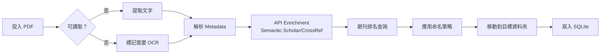
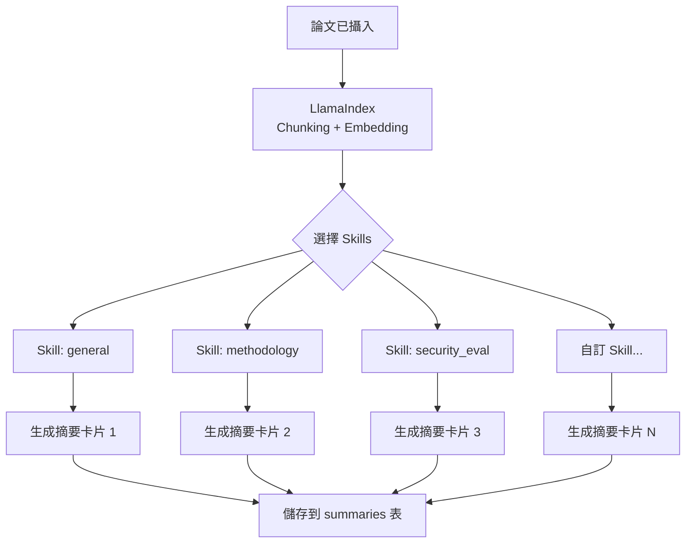
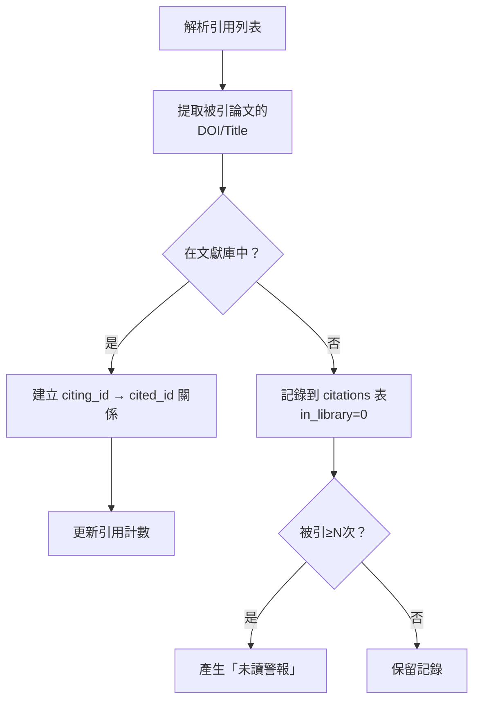
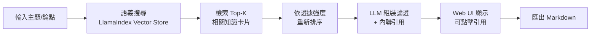

# Cardex

[](./VERSION)
[](./LICENSE)

[English](./README.md) | 繁體中文

> **學術知識管理系統** — 從 PDF 到結構化知識卡片的完整生命週期

Cardex 是一個完全可程式化的學術文獻管理系統，專為研究者設計。它不依賴任何 GUI 應用程式，所有資料儲存在開放格式（SQLite + Markdown），可透過自託管的 Web 服務視覺化。

> ⚠️ **前導版本**：本專案正在開發中（0.X 版本）。1.0.0 正式發佈前可能會有不相容的變更。

## 📇 關於命名

**Cardex** 是 **Card Index**（卡片索引）的縮寫 — 向一個已經消失的圖書館職業致敬：**卡片目錄維護員（Card Catalog Filer）**。

在電腦目錄普及之前（大約1980～2000 年代），圖書館裡有專人負責維護那些裝在木製抽屜裡的索引卡片 — 每新增一本書，就要手寫或打字製作多張卡（依作者、書名、主題各一張），按字母順序插進正確位置。這些工作大多由女性擔任，她們花費了數以萬計的工時建立和維護圖書館的知識記錄，卻長期不受重視。

Cardex 向這些隱形的勞動者致敬，並重新想像數位時代的卡片目錄 — AI 輔助，但研究者始終掌控。


---

## 📋 目錄

- [核心特色](#核心特色)
- [系統架構](#系統架構)
- [工作流程](#工作流程)
- [快速開始](#快速開始)
- [技術棧](#技術棧)
- [開發計畫](#開發計畫)

---

## ✨ 核心特色

### 🎯 設計理念

- **完全可程式化** - 無 GUI 依賴，可用 CLI 或 API 完全操作
- **開放格式** - SQLite（單一真實來源）+ Markdown（知識卡片）
- **自託管** - 不是 SaaS，你的資料永遠在你的機器上
- **AI 驅動** - LlamaIndex + 可插拔 LLM 後端

### 💡 獨特功能

1. **Skill 系統** - 一篇論文可從多個分析角度生成不同摘要
   - 例如：方法論視角、安全性評估、證據強度分析
   - 完全可擴展：只需新增 YAML + Markdown 檔案

2. **證據分級** - 基於期刊/會議排名自動評估證據強度
   - Tier 1（強）: Nature/Science/CORE A* + RCT 方法論
   - Tier 2-4: 依序遞減
   - 可本地覆蓋排名資料

3. **Argue Engine** - AI 輔助論證生成
   - 從你的文獻庫提取相關證據
   - 依證據強度加權排序
   - 生成帶有內聯引用的結構化論述

4. **引用追蹤** - 自動建立引用關係圖
   - 標記「被引用但尚未收錄」的論文
   - 追蹤研究群組和學術譜系

---

## 🏗️ 系統架構

Cardex 採用分層管線設計，每層可獨立透過 CLI 操作，也可透過 Web UI 統一存取：

```
┌─────────────────────────────────────────────────────────────┐
│                         Web UI (Layer 7)                     │
│              FastAPI Backend + React Frontend                │
└─────────────────────────────────────────────────────────────┘
                              ▲
                              │
┌─────────────────────────────────────────────────────────────┐
│  Layer 6: Argue         │  主題輸入 → AI 組裝論證 + 引用     │
├─────────────────────────────────────────────────────────────┤
│  Layer 5: Quality       │  證據強度評估（期刊/會議排名）     │
├─────────────────────────────────────────────────────────────┤
│  Layer 4: Graph         │  建立引用圖、檢測未讀引用         │
├─────────────────────────────────────────────────────────────┤
│  Layer 3: Summarize     │  應用 Skill 定義生成多角度摘要    │
├─────────────────────────────────────────────────────────────┤
│  Layer 2: Metadata      │  提取書目資料 + API enrichment   │
├─────────────────────────────────────────────────────────────┤
│  Layer 1: Ingest        │  檔案攝入、完整性檢查、重命名     │
└─────────────────────────────────────────────────────────────┘
                              ▲
                              │
                         ┌────┴────┐
                         │  PDFs   │
                         └─────────┘
```

---

## 🔄 工作流程

### 階段 1：文獻攝入（Ingest Pipeline）



**說明：**
- 檔案完整性檢查（可開啟、可提取結構）
- 文字提取閾值低於設定值 → 標記為「需要 OCR」（v1 不執行 OCR）
- 從 PDF 中提取標題、作者、年份
- 透過 Semantic Scholar / CrossRef API 補全 DOI、venue 等資訊
- 查詢 CORE / JCR 資料庫取得期刊排名
- 依 YAML 命名策略重新命名並移動到正確資料夾

### 階段 2：知識卡片生成（Skill System）



**說明：**
- 一篇論文可應用多個 Skill
- 每個 Skill 生成一張獨立的摘要卡片
- 所有卡片以 Markdown 格式儲存在 `summaries` 表
- Skill 定義在 `skills/` 資料夾，格式為 YAML + Markdown prompt

**Skill 範例**：
```yaml
# skills/methodology.yaml
name: methodology
description: 專注於研究設計、資料集、評估指標的分析
output_format: markdown
prompt_template: methodology_prompt.md
```

### 階段 3：引用關係圖（Citation Graph）



**說明：**
- 從論文中提取參考文獻列表（LLM 解析或專用 parser）
- 交叉比對文獻庫，標記已收錄 vs. 未收錄
- 「被引用多次但尚未收錄」的論文會在 Web UI 產生警報

### 階段 4：AI 輔助論證（Argue Engine）



**說明：**
- 使用者輸入主題或論點陳述
- 語義搜尋找出最相關的知識卡片
- Tier 1 論文權重更高
- LLM 生成的每個主張都對應到特定論文 + 頁碼
- 輸出包含證據層級徽章

---

## 🚀 快速開始

### 環境需求

- Python 3.10+
- Docker + Docker Compose（用於快速部署）
- （選用）Ollama（本地 LLM 推理）

### 安裝

```bash
# 克隆專案
git clone https://github.com/your-username/cardex.git
cd cardex

# 建立虛擬環境
python -m venv venv
source venv/bin/activate  # Windows: venv\Scripts\activate

# 安裝依賴
pip install -r requirements.txt

# 設定環境變數
cp .env.example .env
# 編輯 .env 填入 API keys（如果使用 OpenAI/Anthropic）
```

### 快速測試

```bash
# 初始化資料庫
python -m cardex.cli init

# 攝入第一篇論文
python -m cardex.cli ingest path/to/paper.pdf

# 啟動 Web UI
python -m cardex.web
# 瀏覽器開啟 http://localhost:8000
```

### Docker 部署

```bash
docker-compose up -d
# Web UI: http://localhost:8000
```

---

## 🛠️ 技術棧

| 層級 | 技術 | 說明 |
|------|------|------|
| **Backend** | FastAPI | 輕量、高效能的 Python Web 框架 |
| **Frontend** | React + Tailwind | v1 可用 Streamlit prototype |
| **Database** | SQLite | 單檔案資料庫，易於備份和遷移 |
| **ORM** | SQLAlchemy | Python SQL toolkit |
| **AI / RAG** | LlamaIndex | 文件索引、向量搜尋、LLM 編排 |
| **LLM** | OpenAI / Anthropic / Ollama | 可插拔後端 |
| **Vector Store** | ChromaDB (v1) / Qdrant (future) | Embedding 儲存 |
| **OCR** | *v1 不實作* | v2 考慮 Marker |
| **Citation Parser** | LLM-based | v1 使用 LLM 解析引用 |

---

## 📊 資料模型

### 核心資料表

**papers** - 論文主表
```sql
id TEXT PRIMARY KEY,           -- SHA256 of original file
title TEXT,
authors TEXT,                  -- JSON array
year INTEGER,
venue TEXT,
venue_rank TEXT,               -- e.g. CORE A*, Q1
doi TEXT,
file_path TEXT,
status TEXT,                   -- unread / reading / done
ocr_required INTEGER,          -- 0 or 1
ingested_at TEXT
```

**summaries** - 知識卡片
```sql
id TEXT PRIMARY KEY,           -- UUID
paper_id TEXT,                 -- FK → papers.id
skill_name TEXT,               -- e.g. methodology, security_eval
content TEXT,                  -- Markdown
generated_at TEXT,
model TEXT                     -- LLM model used
```

**citations** - 引用關係
```sql
citing_id TEXT,                -- FK → papers.id
cited_doi TEXT,
cited_title TEXT,
in_library INTEGER,            -- 0 = not yet ingested, 1 = in library
citation_count INTEGER
```

---

## 📁 檔案系統佈局

```
library/
├── 2024/
│   ├── Nature/
│   │   └── Smith_2024_Quantum_Computing.pdf
│   ├── ICML/
│   │   └── Chen_2024_Neural_Architecture.pdf
│   └── arXiv/
│       └── Lee_2024_Preprint.pdf
├── 2023/
│   └── ...
└── needs_ocr/
    └── unreadable_scan.pdf
```

命名策略在 `config/naming_strategy.yaml` 中定義，可彈性調整。

---

## 🗓️ 開發計畫

### Phase 0：服務基礎（新增 - 當前優先）
- [ ] 配置系統（YAML 格式）
  - 使用者指定文獻庫資料夾路徑
  - 配置儲存在 ~/.cardex/config.yaml
- [ ] CLI 命令
  - `cardex init`：初始化配置
  - `cardex serve`：啟動 Web 服務
- [ ] PDF 掃描器
  - 發現配置資料夾中的所有 PDF
  - 支援遞迴掃描（包含子資料夾）
  - 顯示檔名、大小、路徑
- [ ] Web UI（Streamlit 原型）
  - 顯示發現的 PDF 列表
  - 基本搜尋/過濾（依檔名）
  - 手動刷新按鈕
  - 資料夾配置設定面板
- [ ] **目標**：在任何處理之前，先看到你有哪些 PDF

📄 **詳細規格**：[docs/phase-0-service-foundation.md](./docs/phase-0-service-foundation.md)

### Phase 1：文獻攝入管線（M1-M2）
- [x] 專案腳手架、SQLite schema、Docker Compose
- [ ] Ingest pipeline（不含 OCR）
  - 檔案檢查、文字提取
  - Metadata 解析 + API enrichment
  - 命名策略 + 檔案移動
- [ ] CLI 基礎命令（init, ingest, list）

### Phase 2: AI 能力（M3-M4）
- [ ] LlamaIndex 整合（chunking, embedding, vector store）
- [ ] Skill 系統實作
  - YAML spec parser
  - 內建 Skills: general, methodology
  - 摘要卡片生成
- [ ] Web UI v1（Streamlit prototype）
  - Library view（論文列表）
  - Paper detail view（metadata + 卡片）

### Phase 3: 進階功能（M5-M7）
- [ ] Citation graph 建立
- [ ] 未讀引用警報
- [ ] Argue Engine（語義搜尋 + 證據加權論證）
- [ ] Web UI v2（React + Tailwind）

### Phase 4: 打磨與社群（M8+）
- [ ] 完整文件
- [ ] 測試覆蓋
- [ ] 性能優化
- [ ] 社群貢獻指南

---

## 📖 文件

- [開發指南](./docs/development.md) - 本地開發設定
- [API 文件](./docs/api.md) - REST API 規格
- [Skill 撰寫指南](./docs/skills.md) - 如何建立自訂 Skill
- [命名策略](./docs/naming.md) - 檔案命名規則說明

---

## 🤝 貢獻

本專案以作者自身需求為主要導向，但歡迎社群提交 issue 或討論功能建議。

如需貢獻程式碼，請：
1. Fork 本專案
2. 建立 feature branch (`git checkout -b feature/amazing-feature`)
3. Commit 你的變更（遵循 [AGENTS.md](./AGENTS.md) 中的規範）
4. Push 到你的 branch
5. 開啟 Pull Request

詳見 [CONTRIBUTING.md](./CONTRIBUTING.md)

---

## 📄 授權

授權方式待定（TBD）- 將選擇開源授權，詳見 [LICENSE](./LICENSE)

---

## 🙏 致謝

Cardex 靈感來源於：
- Zotero（文獻管理）
- Obsidian（知識連結）
- LlamaIndex（RAG 架構）
- 以及所有在學術研究中掙扎的研究者們 📚

---

**基於**: [my-vibe-scaffolding](https://github.com/matheme-justyn/my-vibe-scaffolding) v1.10.0

更多關於 README 撰寫的指引，請參考 [.template/docs/README_GUIDE.md](./.template/docs/README_GUIDE.md)
