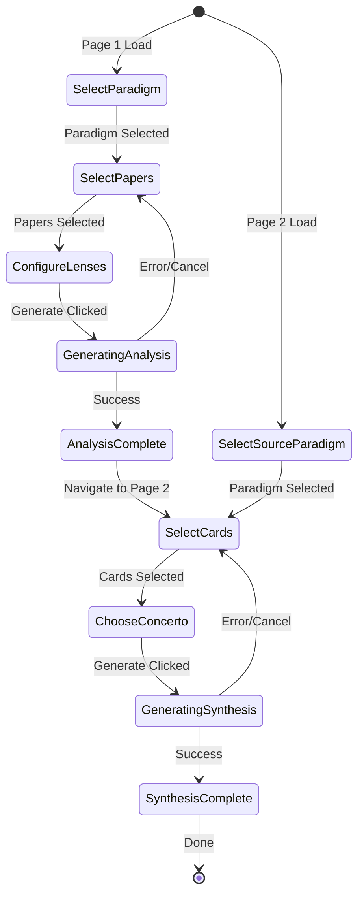

# Cardex - Paradigm System GUI Specification

**Version**: 0.1  
**Date**: March 2026  
**Status**: Design Phase

---

## 1. Overview

This document specifies the two-page Streamlit GUI for Cardex's paradigm-driven analysis system. The system enables researchers to analyze literature through configurable paradigms (派典) and synthesize findings for different audiences via concerti (協奏).

### 1.1 Design Principles

- **Separation of Concerns**: Page 1 (Analysis) and Page 2 (Synthesis) are distinct workflows
- **State Persistence**: User selections carry over between pages where appropriate
- **i18n Support**: All UI text supports English and Traditional Chinese
- **Minimal Clicks**: Smart defaults reduce configuration burden

### 1.2 Navigation Structure

```
Streamlit Multipage App Structure:
├── Home (existing app.py - Library Browser)
├── 🎼 Paradigm Analysis (new - page 1)
└── 🎭 Concerto Synthesis (new - page 2)
```

---

## 2. Page 1: Paradigm Analysis

**File**: `pages/1_🎼_Paradigm_Analysis.py`  
**Purpose**: Select paradigm + papers → Generate analysis cards  
**URL**: `http://localhost:8501/Paradigm_Analysis`

### 2.1 Page Layout

```
┌────────────────────────────────────────────────────────┐
│  🎼 Paradigm Analysis                                   │
│  Analyze your papers through a research paradigm       │
├────────────────────────────────────────────────────────┤
│  📋 Step 1: Select Paradigm                            │
│  ┌──────────────────────────────────────────────────┐  │
│  │ ▼ Select a paradigm                              │  │
│  │   ● IHL Data Privacy (Topic)                     │  │
│  │   ○ Robin - IHL Researcher (Researcher)          │  │
│  │   ○ Critical Legal Studies (School)              │  │
│  │   + Create New Paradigm...                       │  │
│  └──────────────────────────────────────────────────┘  │
│                                                         │
│  ℹ️ Paradigm Details:                                  │
│  • Type: Topic                                          │
│  • Core Questions: 2                                    │
│  • Lenses: 4                                            │
│  • Theoretical Frameworks: IHL, IHRL                    │
│                                                         │
│  [🔍 View Full Configuration] [✏️ Edit]                 │
├────────────────────────────────────────────────────────┤
│  📁 Step 2: Select Papers                              │
│  ┌──────────────────────────────────────────────────┐  │
│  │ 🔍 Search papers by title, author, or keywords   │  │
│  └──────────────────────────────────────────────────┘  │
│                                                         │
│  📂 Quick Folders:                                      │
│  [📁 All Papers (234)] [📁 1_國際法 (23)]              │
│  [📁 2_數據權利 (18)] [📁 Unread (45)]                 │
│                                                         │
│  Selection Mode: ○ Folder  ● Individual Files          │
│                                                         │
│  ┌──────────────────────────────────────────────────┐  │
│  │ ☐ Select All (23 visible)                        │  │
│  │ ─────────────────────────────────────────────    │  │
│  │ ☑ [O'Connell 2022] Privacy Rights During...     │  │
│  │   📄 15 pages · CORE A* · Q1                     │  │
│  │                                                   │  │
│  │ ☑ [Blank 2022] Data as Property Under IHL       │  │
│  │   📄 22 pages · Q2                               │  │
│  │                                                   │  │
│  │ ☐ [West 2022] Precautionary Principle...        │  │
│  │   📄 18 pages · Q1                               │  │
│  └──────────────────────────────────────────────────┘  │
│                                                         │
│  ✅ Selected: 2 papers                                  │
├────────────────────────────────────────────────────────┤
│  🔬 Step 3: Configure Analysis Lenses                  │
│  ☑ Legal Status of Data                               │
│     Examine how this paper defines data's legal status │
│                                                         │
│  ☑ Privacy Rights Continuity                           │
│     Analyze stance on privacy rights during conflict   │
│                                                         │
│  ☐ Legal Gaps Identification                           │
│     Identify gaps in current legal frameworks          │
│                                                         │
│  ☐ Methodological Approach                             │
│     Assess research methodology and evidence           │
│                                                         │
│  [☑ Select All Lenses]                                 │
├────────────────────────────────────────────────────────┤
│  📊 Analysis Summary                                   │
│  • Papers: 2                                            │
│  • Lenses: 2                                            │
│  • Expected Cards: 4 (2 papers × 2 lenses)             │
│  • Estimated Time: ~3 minutes                           │
│                                                         │
│         [🎼 Generate Analysis Cards]                   │
│                                                         │
│  💡 Tip: Cards will be saved to ~/.cardex/analyses/    │
└────────────────────────────────────────────────────────┘
```

### 2.2 Component Specifications

#### 2.2.1 Paradigm Selector

**Component**: `st.selectbox` with custom formatting

**Data Source**: Scan `~/.cardex/paradigms/*.paradigm` files

**Display Format**:
```
{paradigm_name} ({paradigm_type})
```

**Options**:
- Paradigm list from filesystem
- "+ Create New Paradigm..." (triggers creation dialog)

**State Management**:
```python
st.session_state.selected_paradigm = paradigm_name
st.session_state.paradigm_config = load_paradigm_yaml(paradigm_name)
```

**Paradigm Details Display**:
- Type badge (Researcher / Topic / School)
- Core questions count
- Lenses count
- Theoretical frameworks (comma-separated)
- Actions: "View Full Configuration" (expander), "Edit" (opens YAML editor)

#### 2.2.2 Paper Selector

**Selection Modes**:

1. **Folder Mode** (`selection_mode = "folder"`):
   - Radio button: Select entire folder
   - Quick folder buttons with paper counts
   - Example: `[📁 1_國際法 (23)]`

2. **Individual Mode** (`selection_mode = "individual"`):
   - Multi-select checklist
   - Each paper shows:
     - Formatted citation (Author Year)
     - Truncated title
     - Page count
     - Journal rank (CORE A*, Q1, etc.)
     - Status icon (🆕 Unread, 📖 Reading, ✅ Done)

**Data Source**: SQLite `papers` table

**State Management**:
```python
st.session_state.selected_papers = [paper_id1, paper_id2, ...]
st.session_state.selection_mode = "individual" | "folder"
st.session_state.selected_folder = "1_國際法" | None
```

**Search/Filter**:
- `st.text_input` with placeholder "Search papers by title, author, or keywords"
- Real-time filtering (debounced)
- Highlight matched text in results

#### 2.2.3 Lens Selector

**Component**: `st.checkbox` per lens

**Data Source**: `paradigm_config['lenses']`

**Display Format**:
```
☑ {lens_name}
   {lens_description}
```

**Smart Default**: All lenses checked on initial load

**State Management**:
```python
st.session_state.selected_lenses = ["Legal Status of Data", "Privacy Continuity", ...]
```

**Actions**:
- "Select All Lenses" checkbox (master toggle)
- Individual lens checkboxes

#### 2.2.4 Analysis Summary Panel

**Display**:
- Papers count: `len(selected_papers)`
- Lenses count: `len(selected_lenses)`
- Expected cards: `papers × lenses`
- Estimated time: `(papers × lenses × 45 seconds)`

**Generation Button**:
- Label: "🎼 Generate Analysis Cards"
- Type: Primary
- Full width
- Disabled if: `selected_papers == [] or selected_lenses == []`

#### 2.2.5 Progress Indicator

**Component**: `st.progress` + `st.spinner`

**Display During Generation**:
```
Analyzing papers... (2 of 4 cards completed)
▓▓▓▓▓▓▓▓▓▓░░░░░░░░░░ 50%

Currently processing:
[Blank 2022] - Legal Status of Data lens
```

**State Management**:
```python
st.session_state.generation_progress = 0.5  # 0.0 to 1.0
st.session_state.current_task = "[Blank 2022] - Legal Status of Data"
```

#### 2.2.6 Results Display

**Success Message**:
```
✅ Analysis Complete!
Generated 4 analysis cards in 2m 35s

📊 Results Summary:
• 2 papers analyzed
• 2 lenses applied
• 4 cards saved to ~/.cardex/analyses/

[📄 View Cards] [🎭 Continue to Synthesis →]
```

**Actions**:
- "View Cards" → Opens expander showing card previews
- "Continue to Synthesis" → Navigates to Page 2 with state preserved

### 2.3 Page State Management

**Session State Variables**:
```python
{
  "selected_paradigm": "IHL Data Privacy",
  "paradigm_config": {...},  # Loaded YAML
  "selected_papers": [paper_id1, paper_id2],
  "selection_mode": "individual",
  "selected_folder": None,
  "selected_lenses": ["Legal Status of Data", ...],
  "generated_analyses": [analysis_id1, ...],  # After generation
  "last_analysis_timestamp": "2026-03-06T10:30:00Z"
}
```

**Persistence Strategy**:
- Session state preserved during navigation to Page 2
- "Continue to Synthesis" button pre-selects same paradigm on Page 2
- "Recently Analyzed" section on Page 2 shows cards from this session

---

## 3. Page 2: Concerto Synthesis

**File**: `pages/2_🎭_Concerto_Synthesis.py`  
**Purpose**: Select concerto + analysis cards → Generate synthesis document  
**URL**: `http://localhost:8501/Concerto_Synthesis`

### 3.1 Page Layout

```
┌────────────────────────────────────────────────────────┐
│  🎭 Concerto Synthesis                                  │
│  Compose your findings for the target audience         │
├────────────────────────────────────────────────────────┤
│  🎼 Step 1: Select Source Paradigm                     │
│  ┌──────────────────────────────────────────────────┐  │
│  │ ▼ IHL Data Privacy (Topic)                       │  │
│  │   ○ Robin - IHL Researcher (Researcher)          │  │
│  └──────────────────────────────────────────────────┘  │
│                                                         │
│  📊 Available Analysis Cards: 23 cards                 │
│  Last analyzed: 2 hours ago                             │
├────────────────────────────────────────────────────────┤
│  📇 Step 2: Select Analysis Cards                      │
│  Filter by:                                             │
│  [All Cards ▼] [All Lenses ▼] [Last 30 Days ▼]        │
│                                                         │
│  ☐ Select All (23 cards)                               │
│  ┌──────────────────────────────────────────────────┐  │
│  │ ☑ [O'Connell 2022] - Legal Status of Data       │  │
│  │   🔬 Legal Status · 📅 Mar 6, 2026 · 320 words   │  │
│  │   "This paper argues that data should be..."      │  │
│  │   [Preview]                                        │  │
│  │                                                    │  │
│  │ ☑ [O'Connell 2022] - Privacy Continuity          │  │
│  │   🔬 Privacy Rights · 📅 Mar 6, 2026 · 285 words │  │
│  │   "O'Connell contends that privacy rights..."     │  │
│  │   [Preview]                                        │  │
│  │                                                    │  │
│  │ ☐ [Blank 2022] - Legal Status of Data            │  │
│  │   🔬 Legal Status · 📅 Mar 6, 2026 · 412 words   │  │
│  │   [Preview]                                        │  │
│  └──────────────────────────────────────────────────┘  │
│                                                         │
│  ✅ Selected: 2 cards                                   │
├────────────────────────────────────────────────────────┤
│  🎻 Step 3: Choose Concerto                            │
│  ┌──────────────────────────────────────────────────┐  │
│  │ ▼ Journal Submission                             │  │
│  │   ○ Policy Brief                                 │  │
│  │   ○ Conference Presentation                      │  │
│  │   + Create Custom Concerto...                    │  │
│  └──────────────────────────────────────────────────┘  │
│                                                         │
│  🎭 Concerto Details:                                  │
│  • Audience: Academic reviewers and editors            │
│  • Tone: Formal, evidence-based, objective             │
│  • Length: 6,000-10,000 words (target: 8,000)          │
│  • Citation: APA 7th                                    │
│  • Structure: Abstract → Intro → Lit Review →...       │
│                                                         │
│  [🔍 View Full Template] [✏️ Edit]                      │
├────────────────────────────────────────────────────────┤
│  📊 Synthesis Summary                                  │
│  • Cards: 2                                             │
│  • Paradigm: IHL Data Privacy                          │
│  • Concerto: Journal Submission                        │
│  • Expected Length: ~8,000 words                        │
│  • Estimated Time: ~5 minutes                           │
│                                                         │
│         [🎭 Generate Synthesis Document]               │
│                                                         │
│  💡 Output: synthesis/ihl_privacy_journal_2026-03.md   │
└────────────────────────────────────────────────────────┘
```

### 3.2 Component Specifications

#### 3.2.1 Paradigm Selector

**Component**: `st.selectbox`

**Data Source**: Scan `~/.cardex/paradigms/*.paradigm`

**Pre-selection Logic**:
```python
if "selected_paradigm" in st.session_state:
    # Coming from Page 1
    default_index = paradigms.index(st.session_state.selected_paradigm)
else:
    # Fresh load
    default_index = 0
```

**Analysis Cards Count Display**:
- Query SQLite `analyses` table: `SELECT COUNT(*) WHERE paradigm_id = ?`
- Show timestamp of most recent analysis

#### 3.2.2 Analysis Cards Selector

**Filters**:

1. **Lens Filter** (`st.multiselect`):
   - Options: All lenses from selected paradigm
   - Default: All selected

2. **Date Range Filter** (`st.selectbox`):
   - Options: Last 7 days / Last 30 days / Last 3 months / All time
   - Default: Last 30 days

3. **Paper Filter** (optional):
   - Search by paper title/author

**Card Display Format**:
```
☑ [{author} {year}] - {lens_name}
   🔬 {lens_name} · 📅 {created_date} · {word_count} words
   "{first_100_chars}..."
   [Preview]
```

**Preview Modal**:
- Clicking "Preview" opens `st.expander` or `st.dialog`
- Shows full card content (Markdown rendered)
- Options: Include/Exclude from synthesis

**State Management**:
```python
st.session_state.selected_cards = [analysis_id1, analysis_id2, ...]
```

**Smart Defaults**:
- If coming from Page 1 immediately after analysis:
  - Pre-select all cards generated in that session
  - Show "Recently Analyzed" badge on those cards

#### 3.2.3 Concerto Selector

**Component**: `st.selectbox` with custom formatting

**Data Source**: Scan `~/.cardex/concerti/*.concerto` files

**Display Format**:
```
{concerto_name}
```

**Options**:
- Concerto list from filesystem
- "+ Create Custom Concerto..." (triggers creation dialog)

**Concerto Details Display**:
- Audience (primary/secondary)
- Tone
- Target length (min-max, target)
- Citation style
- Structure outline (expandable)
- Actions: "View Full Template" (expander), "Edit" (opens YAML editor)

**State Management**:
```python
st.session_state.selected_concerto = "Journal Submission"
st.session_state.concerto_config = load_concerto_yaml("journal_submission.concerto")
```

#### 3.2.4 Synthesis Summary Panel

**Display**:
- Cards count: `len(selected_cards)`
- Paradigm name
- Concerto name
- Expected length: From concerto config
- Estimated time: `len(selected_cards) × 30 seconds + 2 minutes (synthesis time)`

**Generation Button**:
- Label: "🎭 Generate Synthesis Document"
- Type: Primary
- Full width
- Disabled if: `selected_cards == [] or selected_concerto == None`

**Output Path Display**:
- Auto-generate filename: `synthesis/{paradigm_slug}_{concerto_slug}_{YYYY-MM}.md`
- User can edit via `st.text_input`

#### 3.2.5 Progress Indicator

**Component**: `st.progress` + `st.spinner`

**Display During Synthesis**:
```
Synthesizing document... (Step 3 of 5)
▓▓▓▓▓▓▓▓▓▓▓▓░░░░░░░░ 60%

Current stage: Organizing thematic sections
```

**Stages**:
1. Loading analysis cards
2. Applying concerto template
3. Organizing thematic sections
4. Generating abstract and introduction
5. Formatting bibliography

#### 3.2.6 Results Display

**Success Message**:
```
✅ Synthesis Complete!
Generated document in 4m 12s

📄 Output: synthesis/ihl_privacy_journal_2026-03.md
📊 Statistics:
• Total words: 8,234
• Citations: 23 papers
• Sections: 7

[📄 Open Document] [📋 Copy Path] [🔄 Regenerate]
```

**Actions**:
- "Open Document" → Opens Markdown preview in expander
- "Copy Path" → Copies file path to clipboard
- "Regenerate" → Re-runs synthesis with same settings

### 3.3 Page State Management

**Session State Variables**:
```python
{
  "synthesis_paradigm": "IHL Data Privacy",
  "selected_cards": [analysis_id1, analysis_id2],
  "selected_concerto": "Journal Submission",
  "concerto_config": {...},
  "output_path": "synthesis/ihl_privacy_journal_2026-03.md",
  "generated_synthesis_id": "synth_123",
  "synthesis_complete": True
}
```

---

## 4. Database Integration

### 4.1 Required Tables

#### analyses (existing in PRD)
```sql
CREATE TABLE analyses (
  id TEXT PRIMARY KEY,
  paper_id TEXT NOT NULL,
  paradigm_id TEXT NOT NULL,
  lens_name TEXT NOT NULL,
  content TEXT NOT NULL,  -- Markdown content
  word_count INTEGER,
  created_at TEXT NOT NULL,
  FOREIGN KEY (paper_id) REFERENCES papers(id),
  FOREIGN KEY (paradigm_id) REFERENCES paradigms(id)
);
```

#### paradigms (new)
```sql
CREATE TABLE paradigms (
  id TEXT PRIMARY KEY,
  name TEXT UNIQUE NOT NULL,
  type TEXT NOT NULL,  -- researcher | topic | school
  yaml_content TEXT NOT NULL,
  created_at TEXT NOT NULL,
  modified_at TEXT NOT NULL
);
```

#### syntheses (new)
```sql
CREATE TABLE syntheses (
  id TEXT PRIMARY KEY,
  paradigm_id TEXT NOT NULL,
  concerto TEXT NOT NULL,
  analysis_ids TEXT NOT NULL,  -- JSON array of analysis IDs
  output_path TEXT NOT NULL,
  word_count INTEGER,
  created_at TEXT NOT NULL,
  FOREIGN KEY (paradigm_id) REFERENCES paradigms(id)
);
```

### 4.2 Data Flow

**Page 1 → Database**:
1. User clicks "Generate Analysis Cards"
2. For each (paper, lens) pair:
   - Call LLM with lens prompt + paper content
   - Save result to `analyses` table
   - Store analysis_id in `st.session_state.generated_analyses`

**Page 2 → Database**:
1. Load available cards: `SELECT * FROM analyses WHERE paradigm_id = ?`
2. User selects cards and concerto
3. Clicks "Generate Synthesis"
4. Call LLM with concerto template + selected cards
5. Save result to `syntheses` table and write Markdown file

---

## 5. i18n Support

### 5.1 Translation Keys

**Page 1 (Paradigm Analysis)**:
```toml
# i18n/locales/en-US/app.toml
[paradigm_analysis]
page_title = "Paradigm Analysis"
page_subtitle = "Analyze your papers through a research paradigm"
step1_title = "Step 1: Select Paradigm"
step2_title = "Step 2: Select Papers"
step3_title = "Step 3: Configure Analysis Lenses"

[paradigm_analysis.paradigm_selector]
select_placeholder = "Select a paradigm"
create_new = "Create New Paradigm..."
details_type = "Type"
details_questions = "Core Questions"
details_lenses = "Lenses"
details_frameworks = "Theoretical Frameworks"
action_view_config = "View Full Configuration"
action_edit = "Edit"

[paradigm_analysis.paper_selector]
search_placeholder = "Search papers by title, author, or keywords"
quick_folders_label = "Quick Folders"
all_papers = "All Papers"
unread = "Unread"
selection_mode_label = "Selection Mode"
mode_folder = "Folder"
mode_individual = "Individual Files"
select_all = "Select All"
selected_count = "Selected: {count} papers"

# ... (continue for all UI elements)
```

**Page 2 (Concerto Synthesis)**:
```toml
[concerto_synthesis]
page_title = "Concerto Synthesis"
page_subtitle = "Compose your findings for the target audience"
step1_title = "Step 1: Select Source Paradigm"
step2_title = "Step 2: Select Analysis Cards"
step3_title = "Step 3: Choose Concerto"

# ... (continue for all UI elements)
```

### 5.2 Translation Usage Pattern

```python
# Load i18n
i18n = I18n(st.session_state.locale)

# Use in UI
st.title(i18n.t("paradigm_analysis.page_title"))
st.caption(i18n.t("paradigm_analysis.page_subtitle"))
```

---

## 6. Error Handling

### 6.1 User-Facing Error Messages

**Scenario**: No paradigms found
```python
if len(paradigms) == 0:
    st.warning(i18n.t("errors.no_paradigms"))
    st.info(i18n.t("errors.create_paradigm_help"))
    if st.button(i18n.t("actions.create_first_paradigm")):
        # Open paradigm creation dialog
```

**Scenario**: No papers selected
```python
if len(selected_papers) == 0 and user_clicked_generate:
    st.error(i18n.t("errors.no_papers_selected"))
```

**Scenario**: LLM API failure during generation
```python
try:
    analysis = generate_analysis(paper, lens, paradigm)
except Exception as e:
    st.error(i18n.t("errors.analysis_failed", paper=paper.title))
    st.exception(e)
    # Log error to ~/.cardex/logs/
```

### 6.2 Graceful Degradation

- If paradigm file is corrupted: Show error, allow user to recreate or edit YAML directly
- If analysis takes too long: Show progress bar, allow cancellation
- If synthesis fails: Preserve input state, allow retry with different settings

---

## 7. Performance Considerations

### 7.1 Caching Strategy

**File System Operations**:
```python
@st.cache_data(ttl=60)
def load_paradigms():
    """Cache paradigm list for 60 seconds"""
    return scan_paradigms_folder()

@st.cache_data(ttl=60)
def load_concerti():
    """Cache concerto list for 60 seconds"""
    return scan_concerti_folder()
```

**Database Queries**:
```python
@st.cache_data(ttl=30)
def get_papers_for_folder(folder_path):
    """Cache paper list per folder for 30 seconds"""
    return query_papers(folder_path)
```

### 7.2 Async Processing

**Background Tasks** (future enhancement):
- Large batch analyses (10+ papers) should run in background
- Show notification when complete
- User can continue browsing while analysis runs

---

## 8. Accessibility

### 8.1 Keyboard Navigation

- Tab order follows logical flow: Paradigm → Papers → Lenses → Generate
- Enter key submits forms
- Escape closes modals/dialogs

### 8.2 Screen Reader Support

- All icons have `aria-label` attributes
- Form fields have proper `label` associations
- Progress indicators announce updates

---

## 9. Implementation Checklist

### 9.1 Phase 1: Core Functionality

- [ ] Create `pages/1_🎼_Paradigm_Analysis.py`
- [ ] Create `pages/2_🎭_Concerto_Synthesis.py`
- [ ] Implement paradigm loading from `~/.cardex/paradigms/`
- [ ] Implement concerto loading from `~/.cardex/concerti/`
- [ ] Create `analyses` table in SQLite
- [ ] Create `paradigms` table in SQLite
- [ ] Create `syntheses` table in SQLite
- [ ] Implement analysis generation logic (LLM integration)
- [ ] Implement synthesis generation logic (LLM integration)
- [ ] Add i18n translations for all UI text

### 9.2 Phase 2: Enhanced UX

- [ ] Add paradigm/concerto creation dialogs
- [ ] Add YAML editor with syntax validation
- [ ] Add analysis card preview modal
- [ ] Add synthesis document preview
- [ ] Implement file path clipboard copy
- [ ] Add "Recently Analyzed" section on Page 2

### 9.3 Phase 3: Polish

- [ ] Implement caching for file system operations
- [ ] Add progress indicators with stage descriptions
- [ ] Add keyboard shortcuts
- [ ] Add error recovery mechanisms
- [ ] Add analytics (track usage patterns)

---

## 10. Future Enhancements

### 10.1 Planned Features

- **Batch Analysis Queue**: Queue multiple paradigm × folder combinations
- **Card Editing**: Edit generated analysis cards before synthesis
- **Template Library**: Share paradigm/concerto configurations with community
- **Export Formats**: Export synthesis to PDF, DOCX, LaTeX

### 10.2 Research Directions

- **Active Learning**: Suggest lenses based on paper content
- **Citation Network Visualization**: Show which papers cite each other in selected cards
- **Conflict Detection**: Warn when papers in synthesis have contradictory claims

---

## Appendix A: State Machine Diagram



---

## Appendix B: Wireframe Assets

*(To be created: Figma/Sketch designs for both pages)*

- `wireframes/page1-paradigm-analysis.png`
- `wireframes/page2-concerto-synthesis.png`
- `wireframes/paradigm-selector-detail.png`
- `wireframes/card-preview-modal.png`

---

**Document Maintenance**:
- Update this spec when PRD changes
- Version changes should trigger spec review
- All UI text must have corresponding i18n keys
